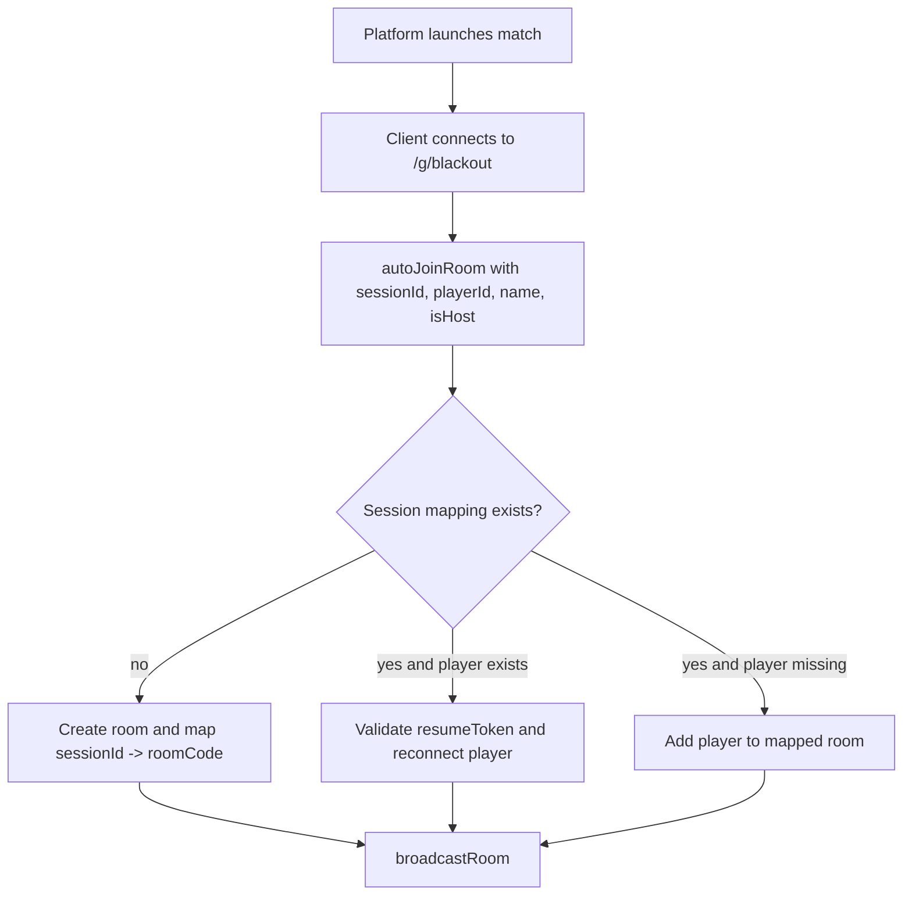
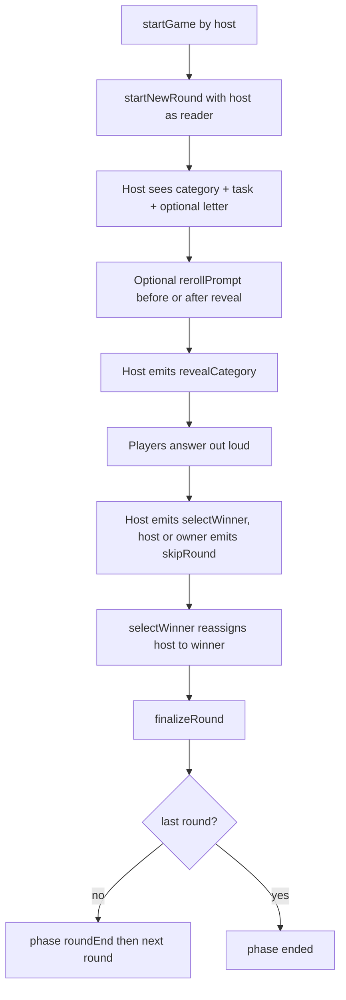
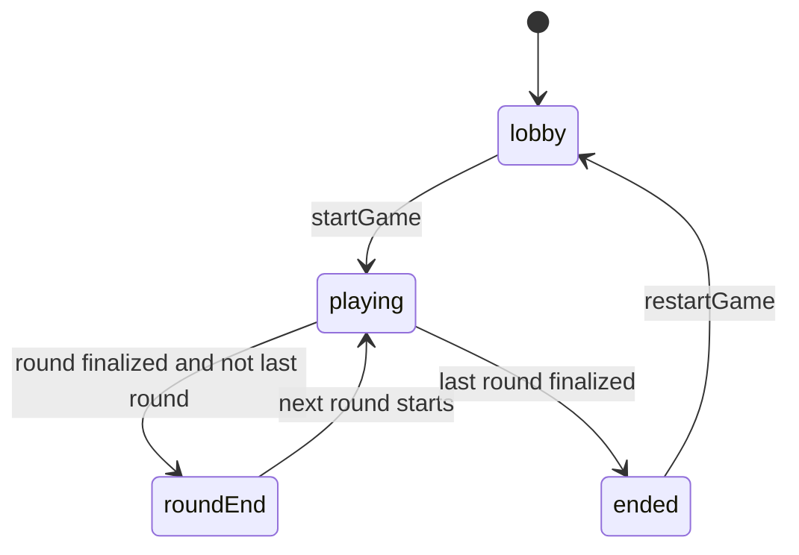

# Blackout Architecture

## High-level Overview

Blackout is split into shared contracts, a Socket.IO game server, and a platform-launched Vue
client.

```text
core (shared contracts)
  -> server (authoritative game state + transitions)
  -> ui-vue (rendering + user input + socket events)
```

Key design goals:

- one authoritative room state on the server
- strict shared event/type contracts between client and server
- per-player sanitized room views
- explicit phase state machine
- platform-owned entry and reconnect flow

## Shared Core (`core/src`)

Shared modules have no runtime dependencies and are imported by both client and server.

- `types.ts`: room/player/round/phase models and room view DTOs
- `events.ts`: Socket.IO event contracts
- `constants.ts`: gameplay timings and limits

Core state model highlights:

- `Room.phase`: `lobby | playing | roundEnd | ended`
- `Room.language`: `de | en` (host configurable in lobby)
- `Room.excludedLetters`: host configurable letter blacklist
- `Room.ownerId`: original room creator within the match
- `Room.hostId`: player currently reading / controlling the round
- `Room.currentRound`: active round payload
- `Room.roundHistory`: completed rounds
- `Room.usedCategoryLetterPairs`: uniqueness tracking for category/task/letter prompts
- `RoomView.usedCategoryIds`: derived from `roundHistory`, sent to clients for duplicate detection

## Server Architecture (`server/src`)

### Models

- `models/room.ts`
  - in-memory room map
  - `sessionId -> roomCode` mapping for platform auto-join
  - cleanup timers for idle/ended rooms
  - session-map cleanup when rooms are deleted
- `models/player.ts`
  - player factory
  - socketId <-> player index mapping

### Managers

- `phaseManager.ts`: phase transitions only
- `roundManager.ts`: round lifecycle (start, reroll, reveal, finalize)
- `scoreManager.ts`: point updates, leaderboard, winner calculation
- `categoryManager.ts`: random category/task/letter prompts from SQLite
- `broadcastManager.ts`: per-player room sanitization + emits

### Socket Handlers

`socketHandlers.ts` wires all events for `/g/blackout`.

Responsibilities:

- validate `autoJoinRoom` / `resumePlayer` session claims
- validate input and permissions (host / owner checks)
- call managers and mutate room state
- broadcast sanitized state
- manage round-to-round phase progression

## Vue Client Architecture (`ui-vue/src`)

### State

`stores/game.ts` holds session and room data:

- current `RoomView`
- local player identity (`playerId`, `playerName`, `resumeToken`)
- derived getters (`isHost`, `isReader`, current phase)

### Socket layer

`composables/useSocket.ts` creates the typed Socket.IO connection to `/g/blackout` and cleans up
on unmount.

### UI composition

`App.vue` is a platform-only phase router:

- no room: connecting / retry state
- `lobby`: setup and start
- `playing`: gameplay (host reveal + winner selection)
- `roundEnd`: short scoreboard
- `ended`: final winner screen

`PlayersPanel.vue` remains visible while in a room. There is no standalone landing or header flow.

## Socket.IO Event Flow

### Room lifecycle flow



### Round gameplay flow



## Phase Transition Flow



## Per-player State Sanitization

All state sent to clients is generated by `broadcastManager.toRoomView`.

Rules:

- remove internal player fields (`resumeToken`, `socketId`)
- show category/task/letter only when:
  - player is current host/reader, or
  - round already revealed
- emit personalized `RoomView` per player socket

Example behavior before reveal:

```ts
const isReader = room.hostId === playerId;
const showPrompt = isReader || round.revealed;

return {
  category: showPrompt ? round.category : null,
  task: showPrompt ? round.task : null,
  letter: showPrompt ? round.letter : null,
};
```

## SQLite and Runtime Notes

- Runtime DB path is resolved via `__dirname` first, then CWD-relative candidates. `DB_PATH` env
  var overrides all.
- DB schema lives in `server/src/db/schema.sql`.
- Default content lives in CSV files under `server/src/db/data/`.
- On startup, missing or empty tables are initialized from those CSV files.
- The platform server (`apps/platform/server/`) runs the game on `/g/blackout`.
- `node games/blackout/scripts/copy-db-assets.mjs` copies schema + CSVs into dist so the next
  start re-seeds from the current CSVs.
