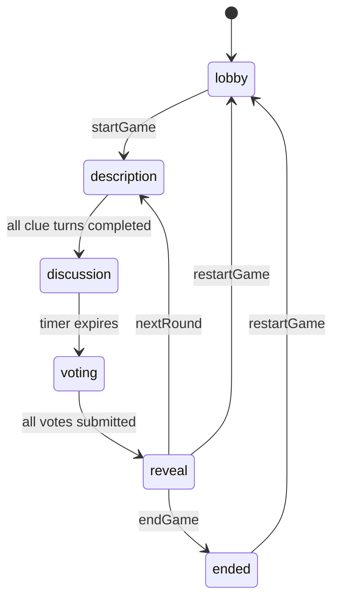

# Imposter - Architecture

## High-level Overview

The project is split into shared contracts, an authoritative Socket.IO game server,
and a Vue 3 client.

```text
core
  -> shared types, events, constants

server
  -> authoritative room state, timers, transitions, sanitization

ui-vue
  -> rendering, local session storage, socket event emission
```

Design goals:

- one authoritative room state on the server
- shared contracts between client and server
- explicit phase transitions
- per-player sanitized room views

## Shared Core (`core/src`)

- `types.ts`
  Room, Player, RoomView, RoundResult, phase types
- `events.ts`
  typed Socket.IO event contracts
- `constants.ts`
  gameplay limits and default values

## Server Architecture (`server/src`)

### Models

- `models/room.ts`
  in-memory room registry, room cleanup timers, `sessionId -> roomCode` map for Game Hub
- `models/player.ts`
  player factory and `socketId -> { roomCode, playerId }` auth index

### Managers

- `managers/gameManager.ts`
  round setup, clue turn order, voting, reveal, scoring, resets
- `managers/broadcastManager.ts`
  converts internal `Room` state into per-player `RoomView`
- `managers/phaseManager.ts`
  thin wrappers used by older tests and transition helpers

### Utilities

- `utils/helpers.ts`
  shared helpers, including crypto-backed random shuffling
- `utils/wordLibrary.ts`
  lazy-loads `server/data/words.txt` and appends custom words

### Socket Handlers

`handlers/socketHandlers.ts` binds the `/g/imposter` namespace.

Responsibilities:

- parse handshake auth (`sessionId`, `joinToken`, `playerId`)
- verify socket ownership for authenticated events
- validate inputs and permissions
- call manager functions for state transitions
- manage discussion / guess timers
- handle owner-host transfer, leave, reconnect, and lobby kick flows
- broadcast sanitized state through `broadcastRoom`

## Room Identity Model

Each room keeps both:

- `ownerId`
  the player who created the lobby
- `hostId`
  the player currently holding host controls

Behavior:

- owner starts as host
- if host disconnects, host transfers to another connected player
- if the owner reconnects, host control returns to the owner automatically

## Standalone Reconnect / Leave Behavior

Standalone mode stores:

- `playerId`
- `roomCode`
- `resumeToken`
- `name`

in local storage on the client.

Reconnect paths:

- `resumePlayer`
  resumes the exact session using the stored `resumeToken`
- `joinRoom`
  can reclaim an active disconnected slot when the same player name rejoins the same room code

Leave behavior:

- in `lobby` or `ended`, the player is removed from the room
- in an active round, the player becomes disconnected so they can reclaim the same slot later

## Embedded Game Hub Behavior

Embedded mode uses:

- `wsNamespace`
- `sessionId`
- `playerId`
- `playerName`
- optional `joinToken`

The client emits `autoJoinRoom`, and the server resolves the room through the in-memory
`sessionId -> roomCode` map. Stable hub player IDs are preserved for reconnects.

## Phase State Machine



## Round Flow

### Round Start

When a round starts:

1. a secret word is selected
2. infiltrators are selected randomly from connected players
3. a shared random `descriptionOrder` is generated
4. `currentDescriberId` is set to the first player in that order

### Description Phase

- clues are entered sequentially, not simultaneously
- every player sees the same shared clue order
- host can skip the active clue turn
- disconnected active players are auto-skipped

### Discussion Phase

- server-owned timer
- default 90 seconds
- configurable in lobby
- transitions automatically to voting

### Voting Phase

- one vote per connected player
- self-votes rejected
- votes remain hidden until everyone has voted or reveal starts

### Reveal Phase

- if infiltrators were caught, they get one final word guess
- while waiting for that guess, the secret word stays hidden
- host may skip the guess
- after resolution, reveal shows the round result

### Match End

Scores persist across rounds until a player reaches `targetScore`.
At that point the game moves to `ended`.

## Server-owned Timers

| Timer | Runtime | E2E | Trigger | Result |
| --- | --- | --- | --- | --- |
| Discussion | configurable, default 90 s | 2 s | all clues done | enters `voting` |
| Guess timeout | 30 s | 3 s | waiting for infiltrator guess | auto-skip guess |
| Room cleanup | 5 min | 5 min | no connected players | deletes room |

`E2E_TESTS=1` only shortens timing-related constants. It does not disable randomness.

## Word Library

The global word list is stored at:

- `server/data/words.txt`

Behavior:

- loaded lazily on first use
- copied into each room as `room.wordLibrary`
- custom lobby words are appended to the global file when writable
- if the file cannot be read, the fallback `DEFAULT_WORD_LIBRARY` is used

## Per-player Sanitization

All client-visible room state is produced by `broadcastManager`.

Rules:

- never expose `resumeToken` or `socketId`
- civilians see the current word, infiltrators do not until final reveal
- `infiltratorIds` stay hidden until `reveal` or `ended`
- `secretWord` stays hidden while `waitingForGuess` is true
- descriptions are shared live once the round is in progress
- votes remain hidden until fully submitted or reveal/ended

## Lobby Controls

Host-only lobby controls currently include:

- configure infiltrator count
- configure discussion timer
- configure target score
- start game
- kick another player from the lobby

Any player may submit a custom word to the library.
